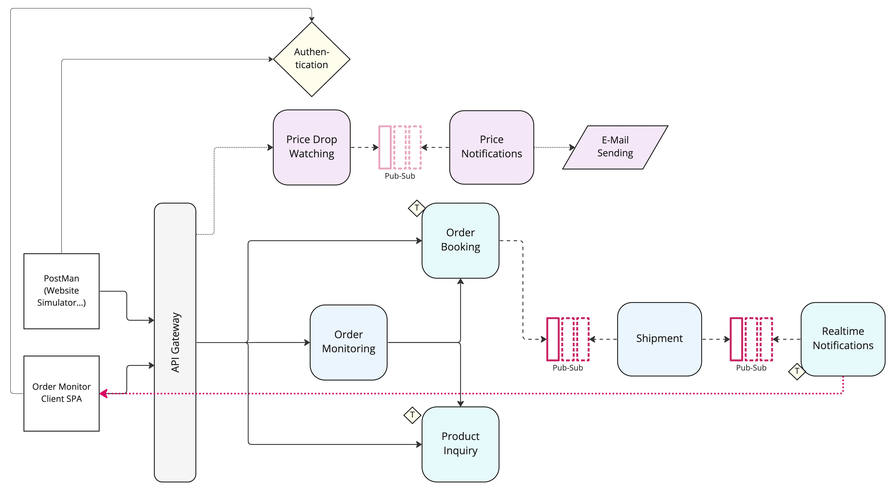

# Cloud-Native Sample Application (Work-in-Progress)

*Note*: This is heavy work in progress - do not rely on the things you see here, yet. Please ask us if you want to adapt things in your code / environment.

[TBD: Some general introduction.]

## Application Diagram

### Architecture overview


### Order Monitor Client

```mermaid
flowchart TD

    A[Browse Order Monitor Client] --> B{Is Authenticated?};
    B -- yes --> F[Call API Gateway];
    B -- no --> D[Authentication Service];
    D -- http --> E[Authenticate with Azure AD];
    E -- token --> D;
    D -- token --> A;
    F -- http --> G[Order Service]
    F -- http --> H[Products Service]
```

### Create an order with Postman

```mermaid
flowchart TD
A[Create Order] -- with token --> B[Call API Gateway];
    B -- http --> C[Order Service];
    C -- mqtt --> D[RabbitMQ];
    D -- mqtt --> E[Shipping Service];
    D -- mqtt --> F[Notification Service];
    F -- ws --> G[Order Management Client];
```

## Docker Compose

### URLs and demo credentials

* Frontend
  * [http://localhost:5005](http://localhost:5005)
* Authentication
  * [http://localhost:5009](http://localhost:5009)
* Gateway
  * Root: [http://localhost:5000](http://localhost:5000)
  * Swagger (Products Service): [http://localhost:5000/products/swagger/](http://localhost:5000/products/swagger/)
  * Swagger (Orders Service): [http://localhost:5000/orders/swagger/](http://localhost:5000/orders/swagger/)
* Grafana
  * [http://localhost:3000](http://localhost:3000)
  * Username: `admin`
  * Password: `admin`
* Zipkin
  * [http://localhost:9411](http://localhost:9411)
* RabbitMQ
  * [http://localhost:15672](http://localhost:15672)
  * Username: `guest`
  * Password: `guest`
* Note: Dapr dashboard does currently not work in Docker compose mode

### Necessary installation for Docker Compose-based setup

```bash
# Install Docker Plugin for Loki
docker plugin install grafana/loki-docker-driver:latest --alias loki --grant-all-permissions
```

### Local Environment

Find the `Makefile` in the root of the repository. Use it to perform common tasks as shown below:

```bash
# Start the sample locally (in docker)
make start 

# Quickstart (no image build) the sample locally (in docker)
make quickstart

# get logs
make logs

# stop the sample
make stop

# clean-up the local docker environment
## stops everything
## removes images
## removes volumes
## removes orphan containers
## removes custom docker network
make cleanup
```

### Common Docker-Compose commands

```bash
# Build Container images
docker-compose build

# Cleanup previously started instances
docker-compose rm -f

# Start cloud-native sample application (detached)
docker-compose up -d
# Start cloud-native sample application (blocking)
docker-compose up

# To stream logs to the terminal use
docker-compose logs
```

### Cleanup environment

```bash
# remove running containers
docker-compose rm -f

# remove custom Docker network
docker network rm cloud-native -f

# uninstall Loki Plugin
docker plugin rm loki -f
```

## Azure environment
### Azure Service Bus
When using Azure SB as a message broker, make sure to have at least a Standard tier in place for topics support (Basic will not work).

Please add your own SAS connection string in the .yaml file for SB.

## Tools

### Load-Testing with Hey

[Hey](https://github.com/rakyll/hey) is a portable load tester

```bash
brew install hey

hey -c 1 -n 1000 http://localhost:5000/products
```

## [Archived] Self-hosting application services with Dapr

### Start Services

### OrdersService

```bash
cd src/OrdersService
dapr run --app-id orders --app-port 5002 --dapr-http-port 9002 --dapr-grpc-port 10002 --components-path ../dapr/components --config ../dapr/config.yaml --log-level debug -- dotnet run
```

### NotificationService

```bash
cd src/NotificationService
dapr run --app-id notification --app-port 5004 --dapr-http-port 9004 --dapr-grpc-port 10004 --components-path ../dapr/components --config ../dapr/config.yaml -- dotnet run
```

### ShippingService

```bash
cd src/ShippingService
dapr run --app-id shipping --app-port 5003 --dapr-http-port 9003 --dapr-grpc-port 10003 --components-path ../dapr/components --config ../dapr/config.yaml --log-level debug -- go run ./cmd/api.go
```

### ProductsService

```bash
cd src/ProductsService
dapr run --app-id products --app-port 5001 --dapr-http-port 9001 --dapr-grpc-port 10001 --config ../dapr/config.yaml -- dotnet run
```

### Gateway

```bash
cd src/Gateway
dotnet run
```

### Authentication

```bash
cd src/AuthenticationService
dotnet run
```

### Dapr Dashboard

```bash
dapr dashboard
```

Navigate to http://localhost:8080.
